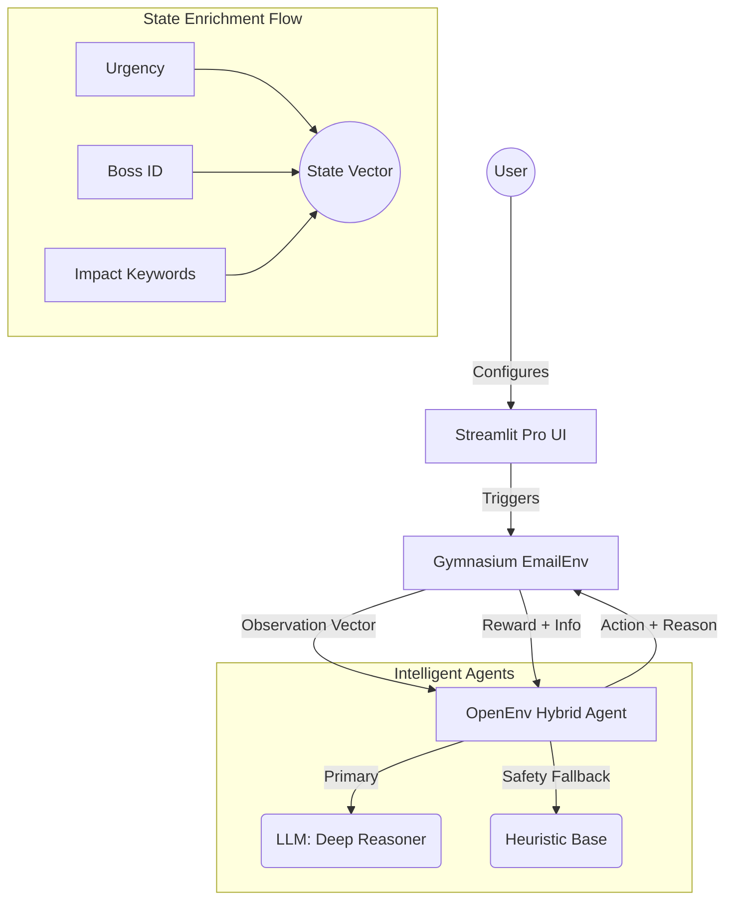

# 📬 MailMind AI: Pro RL Email Assistant

[](https://github.com/openenv-spec)
[]()
[]()

A high-performance, **Explainable Reinforcement Learning** environment for simulating and optimizing real-world email management workflows. MailMind AI uses a hybrid architecture to deliver deep semantic reasoning combined with deterministic safety and speed.

---

## 🌟 Key Features

- **Explainable AI (XAI)**: Every agent action include a natural language `reasoning` field, providing deep context for every decision (e.g., Identifying hidden deadlines or business impact).
- **Boss Priority Detection**: Dedicated reward logic (5x weights) ensures that emails from "Boss" are prioritized with high-impact responses.
- **Hybrid Reasoning Engine**: 
    - **Deep Semantic Layer**: Leverages Gemini 1.5 Flash (via OpenAI-compatible API) for complex intent analysis.
    - **Efficiency Layer**: Optimized heuristics and RL (Q-Learning) handle noise and high-volume routing.
- **OpenEnv Compliant**: Fully implements the [OpenEnv Spec v1.2](https://github.com/openenv-spec), featuring standardized observation/action spaces and grading endpoints.
- **Real-time Analytics**: Built-in Streamlit UI for monitoring live simulations and agent training performance.

---

## 🏛️ System Architecture



---

## 🚀 Quick Start

### 1. Installation
Ensure you have Python 3.10+ installed.

```bash
git clone https://github.com/Bhavyansh-parihar/MailMind-AI
cd MailMind-AI
pip install -r requirements.txt
```

### 2. Configure Environment
Create a `.env` file or export the following variables (required for API-based agents):

| Variable | Description | Default / Example |
| :--- | :--- | :--- |
| `API_BASE_URL` | Endpoint for the LLM Provider | `https://api-inference.huggingface.co/v1` |
| `HF_TOKEN` | Your Hugging Face or provider token | `hf_xxxxxxxxxxxxxx` |
| `MODEL_NAME` | Model ID for reasoning | `meta-llama/Llama-3.1-8B-Instruct` |

### 3. Run the Evaluation
Launch the hackathon-compliant inference script to generate benchmarking results:

```bash
python inference.py
```
*Results will be saved to `results.json`.*

### 4. Run the OpenEnv Server
Deploy the API server for remote interactions or external grading tools:

```bash
python -m server.app
```
*API will be available at `http://localhost:7860/`.*

---

## 📂 Project Structure

- `api.py`: FastAPI server implementation for OpenEnv.
- `env.py`: Core Gymnasium environment (`EmailEnv`) with reward logic.
- `agent.py`: Unified agent implementation (LLM, Heuristic, Random).
- `tasks.py`: Scenario definitions (Easy, Medium, Ambiguous) and grading logic.
- `openenv.yaml`: OpenEnv specification manifest.
- `models.py`: Pydantic schemas for observations, actions, and rewards.
- `inference.py`: Entry point for compliant evaluation.

---

## 🎖️ OpenEnv Integration

MailMind AI is built natively for **OpenEnv**. It exposes the following key endpoints:
- `GET /tasks`: List available scenarios.
- `POST /reset`: Initialize the environment state.
- `POST /step`: Execute an agent action and retrieve the reward.
- `POST /grader`: Automated grading of decision history.

---
*Created for the **Scaler X Meta Hackathon** by **Antigravity Engineering**.*

