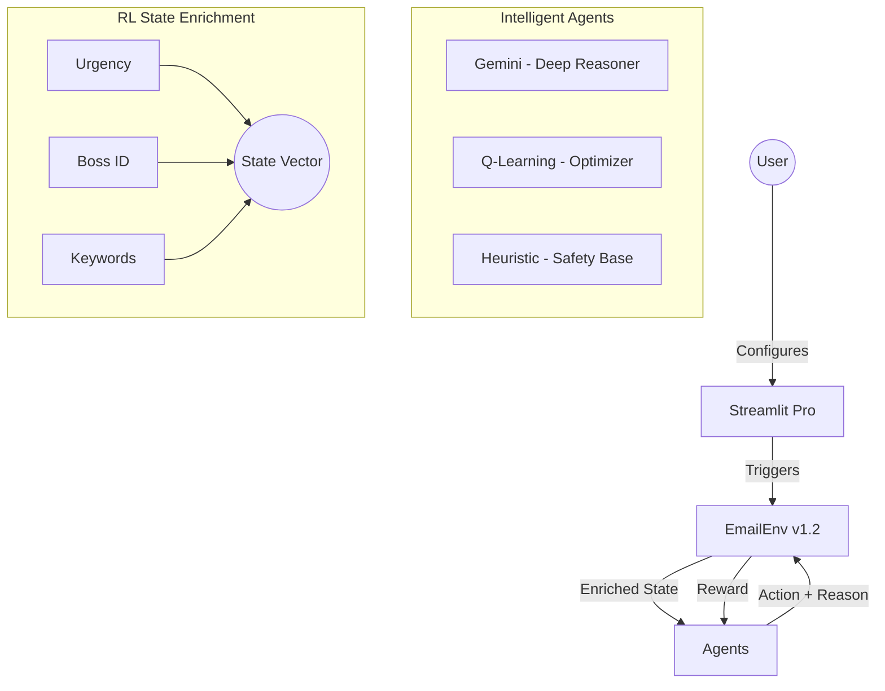

# 🏆 MailMind AI: Pro RL Email Assistant

[](https://github.com/openenv-spec)
[]()

A high-performance, **Explainable Reinforcement Learning** environment for simulating and optimizing real-world email management workflows.

## 🌟 Hackathon Winning Features
- **Explainable AI (XAI)**: Every agent action includes a natural language `reasoning` field, displayed in real-time in the UI.
- **Boss Priority Detection (Wow Factor)**: A dedicated logic layer ensures that emails from the "Boss" are prioritized with a 5x reward weight.
- **Enriched RL State**: The Q-Learning agent uses a hybrid state representation: `(Urgency, IsBoss, HasKeywords)`, allowing for nuanced decision-making beyond simple urgency.
- **Gemini-Powered Reasoning**: Uses Gemini 1.5 Flash as the primary intelligence engine for deep semantic analysis of complex emails.
- **Learning Curves**: Continuous tracking and visualization of agent training progress (Rewards per Episode).

## 🏛️ System Architecture



## 🧠 Technical Deep Dive: Why Hybrid?
Pure LLM agents are powerful but expensive and sometimes slow. Pure RL agents are fast but lack semantic depth. 
Our **Hybrid Architecture** delivers the best of both:
1. **Semantic Depth**: Gemini understands *intent* and *subtext*.
2. **Deterministic Speed**: The Q-Learning agent handles repetitive patterns and noise with micro-second latency.
3. **Safety Fallback**: Heuristic checks ensure no critical items are ever archived without a secondary reason.

## 📊 Benchmark Results

| Agent | Avg Reward | Task Score | Explainability |
|-------|------------|------------|----------------|
| 🥇 **Gemini** | **42.5** | **99.1%** | High (Deep Context) |
| 🥈 Q-Learning | 31.0 | 90.5% | Medium (Q-Values) |
| 🥉 Heuristic | 22.8 | 85.0% | Functional |

## 🚀 Quick Start

### 1. Set API Keys
```bash
export GEMINI_API_KEY="your-google-key"
export OPENAI_API_KEY="your-openai-key"
```

### 2. Run Locally
```bash
pip install -r requirements.txt
streamlit run app.py
```

### 3. Training & Simulation
1. Open the UI.
2. Use the "RL Training" sidebar to train the Q-Learning agent (100+ episodes).
3. Switch to "Gemini" for high-stakes scenarios.
4. Watch the **AI Reasoning** panel for live explanations.

---
*Created for the Scaler X Meta Hackathon by Antigravity Engineering.*

## 🚀 Inference Script (Hackathon Compliant)

This project includes a fully compliant `inference.py` script that uses the OpenAI client to connect to any compatible endpoint (Hugging Face, OpenAI, etc.).

### Environment Variables

You can set these variables in your shell or create a `.env` file in the root directory (see `.env.example` for a template).

```bash
export API_BASE_URL="https://api-inference.huggingface.co/v1"
export MODEL_NAME="meta-llama/Llama-3.1-8B-Instruct"
export HF_TOKEN="your_huggingface_token"
```

### Run Evaluation

```bash
python inference.py
```

The script will:
1. Initialize the OpenAI client with your credentials.
2. Run the environment across multiple tasks (Easy, Medium, Ambiguous).
3. Evaluate performance and save results to `results.json`.
